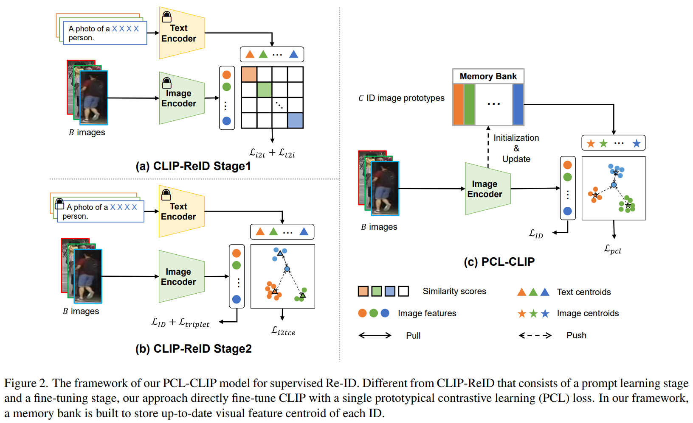

# Prototypical Contrastive Learning-based CLIP Fine-tuning for Object Re-identification

[](https://paperswithcode.com/sota/unsupervised-person-re-identification-on-12?p=prototypical-contrastive-learning-based-clip) \
[](https://paperswithcode.com/sota/unsupervised-vehicle-re-identification-on?p=prototypical-contrastive-learning-based-clip) \
[](https://paperswithcode.com/sota/unsupervised-person-re-identification-on-4?p=prototypical-contrastive-learning-based-clip)


[[paper]](https://arxiv.org/pdf/2310.17218.pdf)

In this work, we propose a simple yet effective approach to adapt CLIP for supervised Re-ID, which directly fine-tunes the image encoder of CLIP using a Prototypical Contrastive Learning loss. Experimental results demonstrate the simplicity and competitiveness of our method compared to recent prompt-learning-based [CLIP-ReID](). Futhermore, our investigation indicates the essential consistency between the CLIP-ReID and our method.

This fork also includes a video person ReID demo pipeline:

```text
YOLOv8 person detection -> ByteTrack tracking -> PCL-CLIP identity matching
```

## Upload History

* 2023/11/23: Full model (ID loss + CC loss) is ready.

## Pipeline


## Installation

Install `conda` before installing any requirements.

```bash
conda create -n pclclip python=3.9
conda activate pclclip
pip install -r requirements.txt
```

For the video demo, install the additional dependencies:

```bash
pip install -r requirements-video.txt
```

## Datasets

Make a new folder named `data` under the root directory. Download the datasets and unzip them into `data` folder.
* [Market1501](https://drive.google.com/file/d/0B8-rUzbwVRk0c054eEozWG9COHM/view)
* [MSMT17](https://arxiv.org/abs/1711.08565)
* [VeRi776](https://github.com/JDAI-CV/VeRidataset)

Large datasets are not committed to Git. The local `data/` directory is ignored by `.gitignore`.

## Training

For example, training the full model on Market1501 with GPU 0 and saving the log file and checkpoints to `logs/market-pclclip`:

```
CUDA_VISIBLE_DEVICES=0 python train_pcl.py --config_file config/pcl-vit.yml DATASETS.NAMES "('market1501')" OUTPUT_DIR logs/market-pclclip
```

Configs can be modified from `config/*.yaml` files or from command line. If you want to add more config terms, update `config/defaults.py`. For other models using different losses, please modify the code according to the paper.

## Video Person ReID Demo

The video demo is documented in [VIDEO_REID.md](VIDEO_REID.md). It supports:

* YOLOv8 person detection.
* ByteTrack multi-object tracking through Ultralytics `bytetrack.yaml`.
* PCL-CLIP feature extraction from tracked person crops.
* Gallery-based identity matching and annotated video output.
* MOT17 image-sequence inputs through `--image_dir`.

Quick tracking-only example on MOT17:

```bash
python demo_video_reid.py \
  --image_dir data/MOT17/images/train/MOT17-02-SDP/img1 \
  --output outputs/MOT17-02-SDP_track.mp4 \
  --detector yolov8s.pt \
  --tracker bytetrack.yaml \
  --fps 30 \
  --no_gallery
```

For identity matching, first build a gallery feature bank:

```bash
python tools/build_gallery.py \
  --config_file config/pcl-vit.yml \
  --weight logs/market-pclclip/ViT-B-16_60.pth \
  --gallery_dir gallery \
  --output gallery_features.pt
```

Then run the ReID demo:

```bash
python demo_video_reid.py \
  --config_file config/pcl-vit.yml \
  --weight logs/market-pclclip/ViT-B-16_60.pth \
  --gallery_features gallery_features.pt \
  --video examples/videos/input.mp4 \
  --output outputs/input_reid.mp4 \
  --detector yolov8s.pt \
  --tracker bytetrack.yaml
```

## Repository Hygiene

The repository tracks source code and documentation only. Local datasets, trained weights, YOLO weights, feature banks, logs, and generated videos are ignored:

```text
data/
logs/
outputs/
gallery/
gallery_mot17/
*.pth
*.pt
gallery_features*.pt
```

Download datasets and weights separately, or generate them following the commands above.

## Acknowledgement

The code is implemented based on following works. We sincerely appreciate their great efforts on Re-ID research!

1. [TransReID](https://github.com/damo-cv/TransReID)
2. [CLIP-ReID](https://github.com/Syliz517/CLIP-ReID)
3. [ClusterContrast](https://github.com/alibaba/cluster-contrast-reid)
4. [CAP](https://github.com/Terminator8758/CAP-master)
5. [O2CAP](https://github.com/Terminator8758/O2CAP)

## Citation
```bib
@article{li2023prototypical,
  title={Prototypical Contrastive Learning-based CLIP Fine-tuning for Object Re-identification},
  author={Li, Jiachen and Gong, Xiaojin},
  journal={arXiv preprint arXiv:2310.17218},
  year={2023}
}
```
